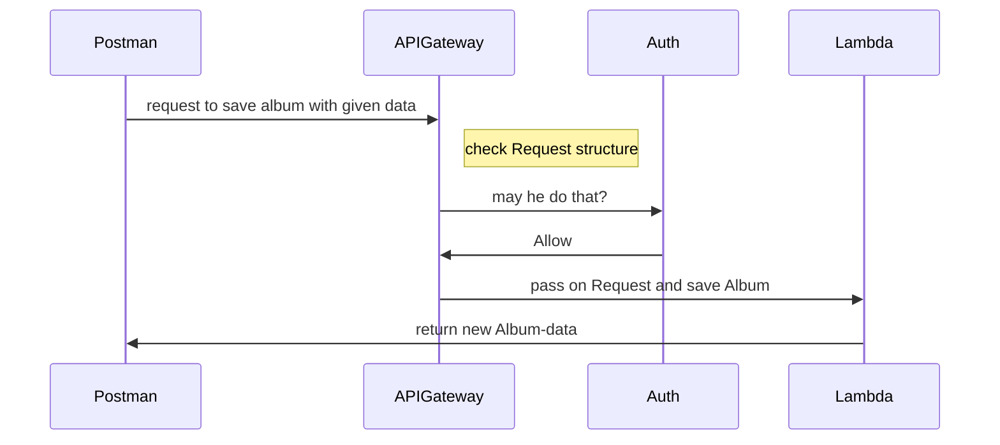
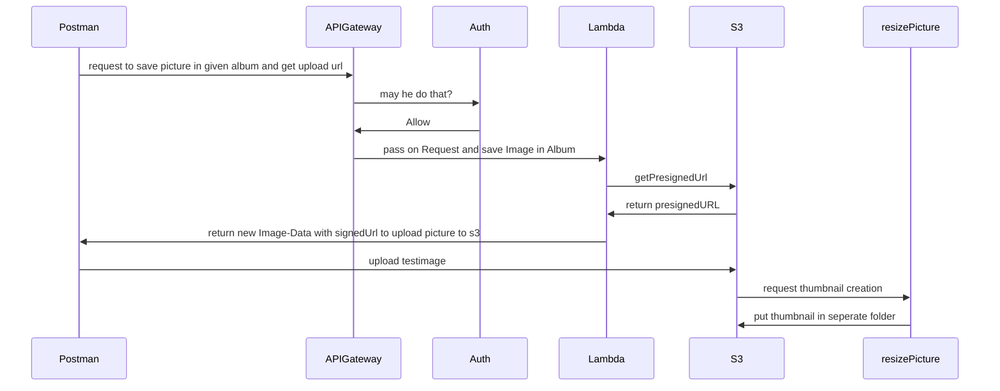
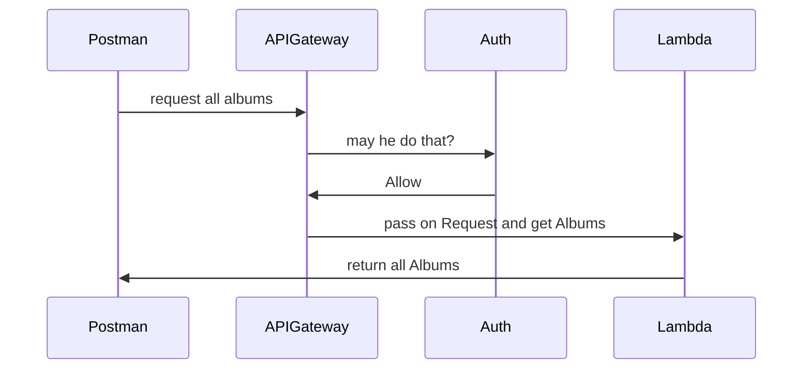
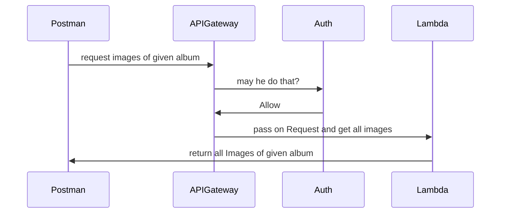
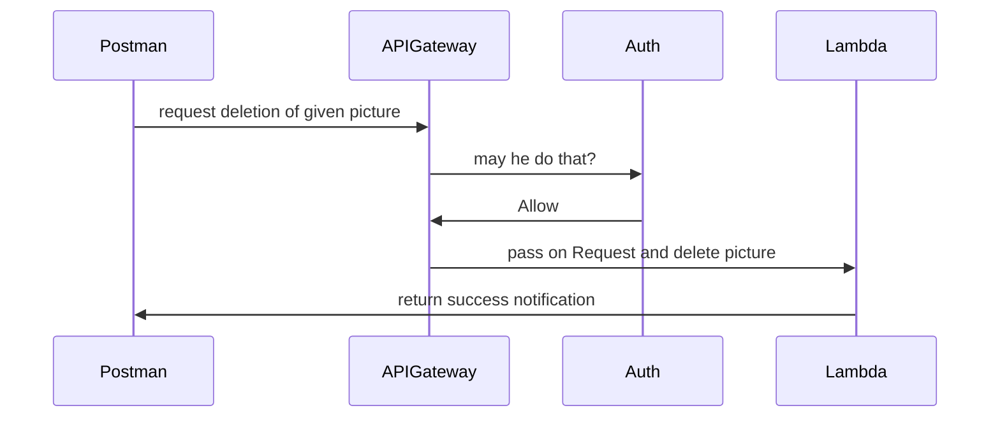
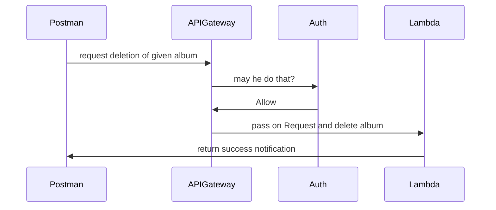

# Udacity Cap-Stone Submission

Hey there, this is my cap-stone project featuring an image gallery.
I'm not a UI guy, so the UI part is missing, but you can test the endpoints with the postman collection in "test-suites" folder.

There are two folders

|Folder| Description  |
|--|--|
|Auth Request |  All Request are authenticated with a pre-request script stored in the globals of the collection itself. I'll explain the config farther down|
|Auth Request Auto-Test|The same as above, but you can run these in an collection runner. There are passing the responses in variables which will be used by the next request|

**Auth variables**
You have to put these into your collection (with the correct values) to get the auth running. I'll give examples which will not run. I'll send you the real values over the submission descriptions

|Vaiable|Example  |
|--|--|
|auth0_domain| udagram-xxxxx-serverless.eu.auth0.com |
|auth0_client_id|6789GHHJJKU88lll625ExPRRtYMxylYYZ4I|
|auth0_client_secret|7sdhf9gfHJKisdhf-07364hHHJJJJJKpiosdagfasgsadgsadügisad|
|auth0_audience|http://udacity-capstone-api/|

**The Test are doing this (this explains the "good" case without errors. Errors are handled, of course, but not shown in diagrams)**

SaveAlbum

SavePicture

GetAlbums

GetAlbum

DeletePicture

DeleteAlbum

**Future features:**

UI (obviously :-), but only after finishing the UI nanodegree)
UpdateAlbum function

